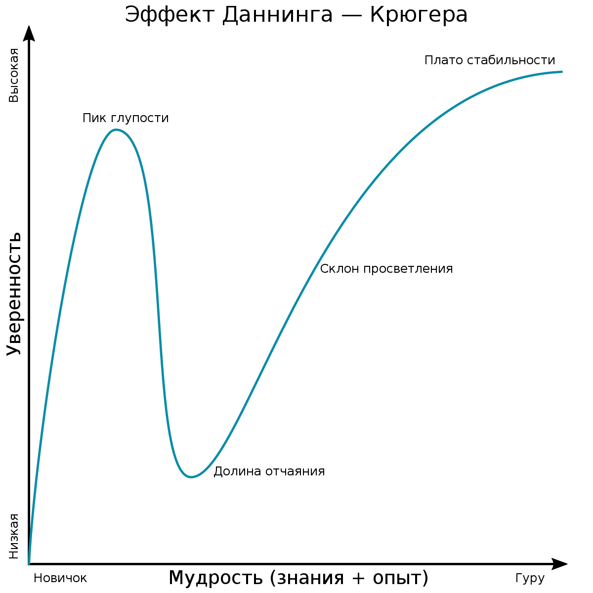

Добрый день, меня зовут Ланских Ярослав.  
На это странице было слишком пусто, добавил картинок!

Аналитик данных, сделал несколько проектов. Советую смотреть последний,  
там в конце душещипательная история.

***[pet_HH vacancies](https://github.com/IaroslavLanskikh/Projects/tree/main/pet_hh)***

Прошёл курс Яндекс Практикума: Аналитика данных по программе Цифровые Профессии.

Искренне хочу быть на *склоне просветления*, но сам не понимаю где я. 

 
# Инструменты:
 - ***Python***: pandas, matplotlib, seaborn, plotly, re, numpy, BS4, requests, stats.
   
 - ***SQL***: CTE, join, window functions, PostgreSQL, ClickHouse.
   
 - ***Визуализация***: Tableau Public, Redash, Python Libraries.
   
 - ***Продуктовые метрики***: LTV,ARPU,ARPPU,CAC,ROI, Retention rate, Churn rate.
   
 - ***A/B***: приоритизация гипотез, анализ результатов теста, проведение стат.тестов, требования к проведению тестов.
   
 - ***Другое***: HH API, TG BOT API, Docker(dockerfile,docker compose), web scraping, построение ETL процессов,  
работа с терминалом (bash,sh), vim(научился выходить), Git.

 - ***В планах***: Развернуть airflow, в него потыкаться.

## email: yaroslavlanskih@gmail.com
## telegram: https://t.me/lanskikh_iaroslav

## Тут хранятся учебные проекты с курса Яндекс Практикума: Аналитик данных, выполненные тестовые задания и мои проекты: [Кликай](https://github.com/IaroslavLanskikh/Projects)
